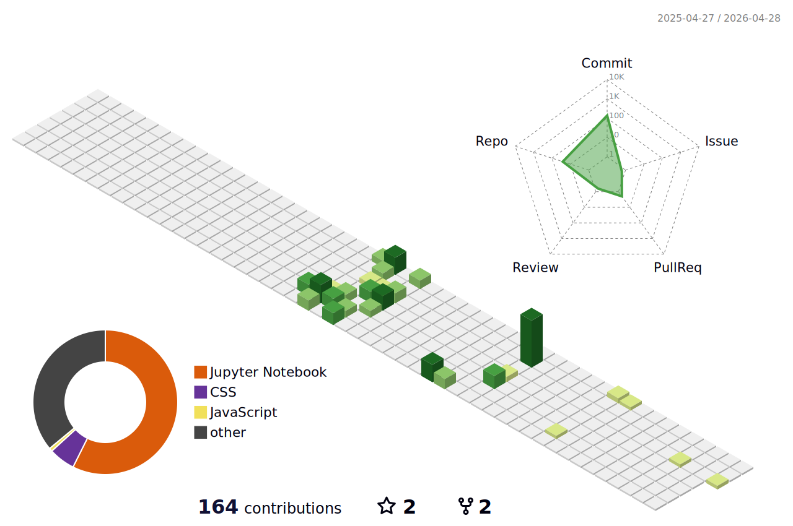

<!-- Profile Header -->
<h1 align="center">Hi 👋, I'm VENMUGIL RAJAN S</h1>

  

<h3 align="center">Computer Science and Engineering Student</h3>

<!-- Coder GIF Right Side -->

<!-- Short Intro -->
- 🔭 Currently learning **Web Development & Full Stack Development**
- 🎓 Pursuing **B.E Computer Science and Engineering**
- 🌱 Exploring **UI/UX Design, Problem Solving & DSA**
- 💡 Love building **web apps, clean UIs, and interactive experiences**
- 📫 How to reach me: **[venmugilrajans@gmail.com](mailto:venmugilrajans@gmail.com)**
- ⚡ Fun fact: **Debugging is part of the daily routine**

---

### 💻 Technical Skills

#### Languages & Web

  
  
  
  
  
  
  

#### Database & Tools

  
  
  
  
  

- **Interests:** Full Stack Development, UI/UX Design, Problem Solving  

---

## 📊 Modern GitHub & LeetCode Stats

<!-- GitHub Stats Row -->

  <!-- Main GitHub Stats (transparent, clean) -->
  

  <!-- Languages as donut chart (modern) -->
  

---

<!-- LeetCode row -->

  

---

## 🧊 3D Contribution Calendar

  

---

## 🗓️ Contribution Activity

  

---

## 🌐 Connect with Me

  
  
  
  

