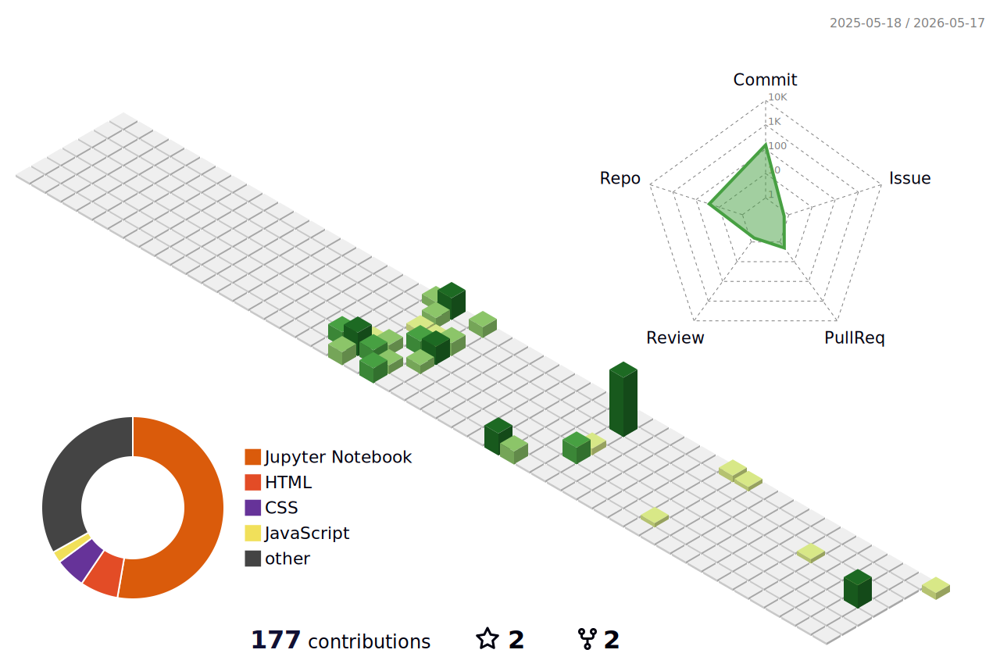

<h1 align="center">Hi 👋, I'm VENMUGIL RAJAN S</h1>

  

<h3 align="center">Computer Science and Engineering Student</h3>

  

- 🔭 Currently learning **Web Development & Full Stack Development**
- 🎓 Pursuing **B.E Computer Science and Engineering**
- 🌱 Exploring **UI/UX Design, Problem Solving & DSA**
- 💡 Love building **web apps, clean UIs, and interactive experiences**
- 📫 How to reach me: **[venmugilrajans@gmail.com](mailto:venmugilrajans@gmail.com)**
- ⚡ Fun fact: **Debugging is part of the daily routine**

---

### 💻 Technical Skills

  <h4>Languages & Web</h4>
  

    
  

  <h4>Database & Tools</h4>
  

    
  

 

- **Interests:** Full Stack Development, UI/UX Design, Problem Solving  

---

## 📊 GitHub Stats

  

  

---

## 🧊 3D Contribution Calendar

  

---

## 🗓️ Contribution Activity

  

---

## 🌐 Connect with Me

  
  
  

